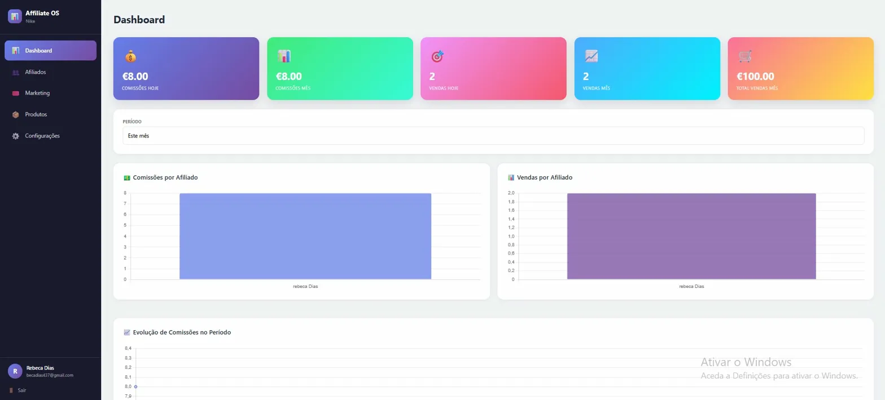

# 🚀 Affiliate OS SaaS

> Plataforma SaaS de gestão de afiliados — independente de qualquer CMS ou plataforma de e-commerce.


---

## 📸 Preview



---

## 📋 Sobre o Projeto

O **Affiliate OS** nasceu da transformação de um plugin WordPress de afiliados num SaaS standalone completo. O sistema permite que empresas (clientes) gerem os seus próprios programas de afiliados, com rastreamento de vendas via API REST, independente de qualquer plataforma de loja.

---

## 🏗️ Arquitectura

```
Owner (dono do SaaS)
└── Empresas (clientes)
    ├── Admin (gestor da empresa)
    │   ├── Afiliados (com código único e link de afiliado)
    │   ├── Cupões (desconto %, frete grátis, validade, limite de usos)
    │   ├── Produtos (com % de comissão por produto)
    │   └── Comissões (geradas automaticamente via API)
    └── API Key (integração com qualquer loja)
        
Afiliado
└── Dashboard próprio (métricas, relatórios, links, notificações)
```

### Multi-tenancy
Cada empresa tem os seus próprios dados completamente isolados. Um admin só vê os dados da sua empresa. Um afiliado só vê as suas comissões.

---

## ⚙️ Stack Tecnológico

| Camada | Tecnologia |
|--------|-----------|
| Backend | Laravel 13 (PHP 8.4) |
| Frontend | React 18 + Inertia.js |
| Build Tool | Vite 8 |
| Base de Dados | SQLite (dev) / MySQL (prod) |
| Autenticação | Laravel Breeze |
| Gráficos | Chart.js 4 |

---

## ✅ Funcionalidades Implementadas

### 👑 Painel do Owner
- Dashboard global com métricas do SaaS (empresas, afiliados, vendas, comissões)
- Ranking de empresas por volume de vendas
- Gráfico de crescimento de empresas por mês
- Actividade recente de todas as empresas
- Gestão completa de empresas (criar, editar, ativar/desativar, deletar)
- Geração e regeneração de API Key por empresa
- Trocar admin de uma empresa

### 🏢 Painel do Admin (Empresa)
- Dashboard com métricas em tempo real (comissões, vendas, gráficos)
- Filtros por período (hoje, semana, mês, personalizado)
- Modal de detalhes por afiliado com histórico de vendas e gráficos
- Gestão de afiliados com código único de afiliado para links rastreáveis
- Gestão de cupões (desconto %, frete grátis, validade, limite de usos)
- Gestão de produtos com % de comissão por produto
- Configurações com API Key visível para integração

### 👤 Painel do Afiliado
- Dashboard com 8 métricas (comissões e vendas por período)
- Gráfico comparativo mensal
- Relatório detalhado com filtros por mês/ano
- Link de afiliado único e copiável
- Notificações automáticas quando comissões são canceladas

### 🔌 API REST
- `POST /api/v1/sales` — registar venda com cupão e/ou código de afiliado
- `POST /api/v1/cancel` — cancelar comissão (gera notificação automática ao afiliado)
- `GET /api/v1/coupons/{code}` — validar cupão antes de aplicar desconto
- Autenticação por `X-API-Key` no header
- Cálculo automático de comissão por produto
- Suporte a comissão por cupão E por link em simultâneo
- Regra anti-duplicação (mesmo afiliado = 1 comissão)
- Idempotência (evita duplicados pelo order_id)

---

## 🗺️ Roadmap

- [x] Dashboard do Owner com métricas globais do SaaS
- [x] Dashboard do Admin com gráficos e filtros
- [x] Cancelamentos via API com notificações automáticas
- [x] Links rastreáveis por afiliado (affiliate_code)
- [x] Painel do Afiliado completo
- [x] Menu lateral em todos os painéis
- [ ] Plugin WordPress para integração automática com WooCommerce

---

## 🚀 Instalação

```bash
# Clonar o repositório
git clone https://github.com/RebecaEvelyn/Affiliate-os.git
cd Affiliate-os

# Instalar dependências PHP
composer install

# Instalar dependências Node
npm install --legacy-peer-deps

# Configurar ambiente
cp .env.example .env
php artisan key:generate

# Executar migrations
php artisan migrate

# Criar utilizador owner inicial
php artisan db:seed --class=OwnerSeeder

# Iniciar servidores
php artisan serve
npm run dev
```

---

## 📡 API — Exemplos de Uso

### Registar venda por cupão
```bash
curl -X POST https://seu-dominio.com/api/v1/sales \
  -H "X-API-Key: sua_api_key" \
  -H "Content-Type: application/json" \
  -d '{
    "order_id": "1001",
    "coupon_code": "CUPAO2026",
    "product_id": "123",
    "amount": 50.00
  }'
```

### Registar venda por link de afiliado
```bash
curl -X POST https://seu-dominio.com/api/v1/sales \
  -H "X-API-Key: sua_api_key" \
  -H "Content-Type: application/json" \
  -d '{
    "order_id": "1002",
    "affiliate_code": "JOAO123",
    "product_id": "123",
    "amount": 50.00
  }'
```

### Cancelar comissão
```bash
curl -X POST https://seu-dominio.com/api/v1/cancel \
  -H "X-API-Key: sua_api_key" \
  -H "Content-Type: application/json" \
  -d '{"order_id": "1001"}'
```

### Validar cupão
```bash
curl -X GET https://seu-dominio.com/api/v1/coupons/CUPAO2026 \
  -H "X-API-Key: sua_api_key"
```

---

## 👩‍💻 Autora

**Rebeca Dias** — Full Stack Developer (PHP / JavaScript / Laravel / React)

---

*Transformando um plugin WordPress num SaaS escalável e independente de plataforma.*
